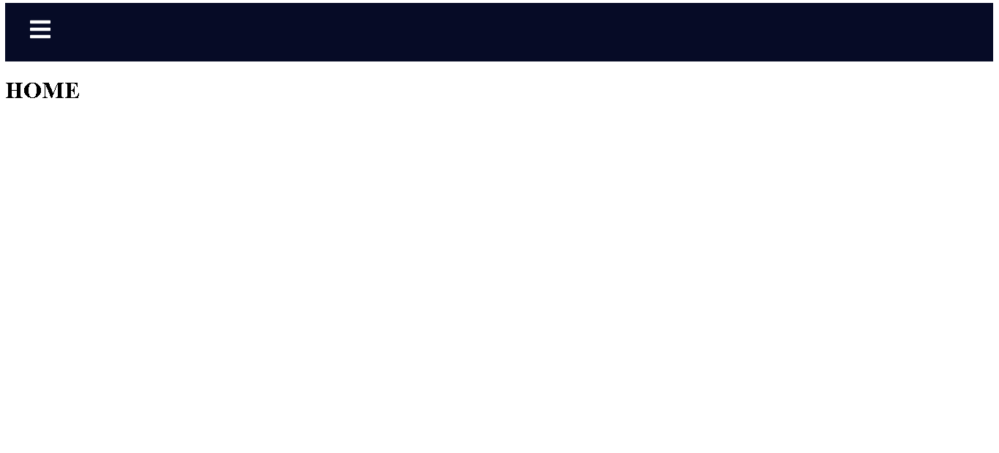
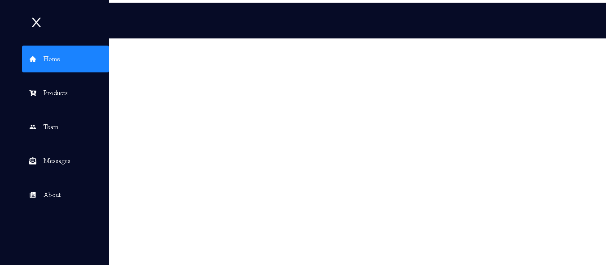

# Sidebar com React
Estrutura e Estilização de Sidebar com React

## Tecnologias aplicadas nesse projeto
- React
- React Router Dom
- React Icons
- CSS

<h1 align="center">
    
</h1>
<h1 align="center">
    
</h1>

### `yarn start`

Runs the app in the development mode.\
Open [http://localhost:3000](http://localhost:3000) to view it in the browser.

The page will reload if you make edits.\
You will also see any lint errors in the console.

## 👨🏼‍🚀 Desenvolvido por:

Paulo Ricardo Favaro da Silva Junior

 [@Linkedin](https://www.linkedin.com/in/paulo-ricardo-favaro-da-silva-junior-79092ab8/) | [@Instagram](https://www.instagram.com/prjr_dexter/)